# Tiny Tea Shop

Tiny Tea is a site dedicated to a local tea shop with a welcoming atmosphere that serves quality tea not only during the day but late into the evening, unlike most traditional cafes in Dublin. It gives people a place to go after the sun goes down where they can go to relax and unwind in a cozy environment with loads of treats.

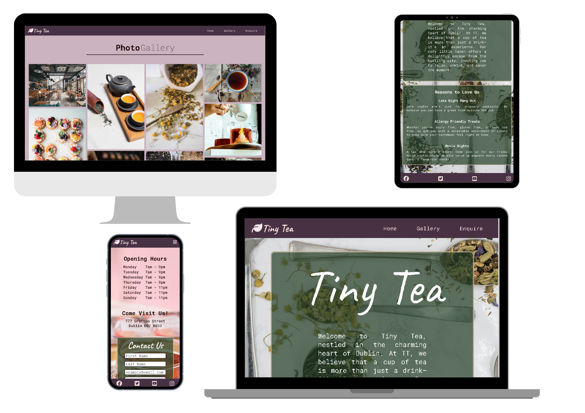

## Features

### Existing Features

#### Navigation Bar

- On all three pages, there is a navigation bar with links to each specified menu bar item/page.
- This section will allow the user to get to know the tea shop briefly and seamlessly transition from page to page intuitively.

#### The Landing Page Image

- The landing includes a photograph of the teas Tiny Tea has to offer along with a quick summary of what Tiny Tea stands for in the community.
- This section aims to draw the visitor in with images of tea, a summary of what the tea shop has to offer, and a reasons to love us section to show visitors what sets us apart from other establishments.

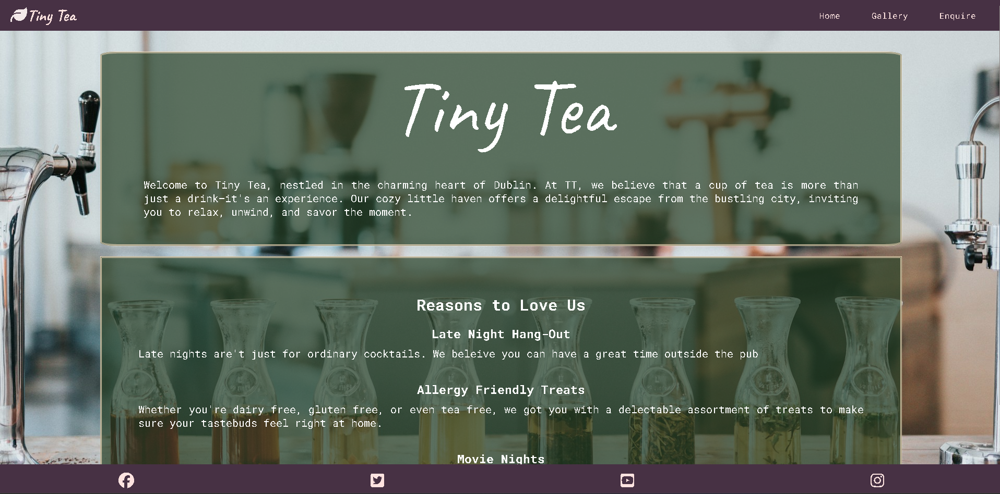

#### Tiny Tea Summary

- The Tiny Tea summary will show readers what the shop has to offer outside of just having a cup of tea.
- This user will find it easy to discern what the tea shop’s purpose is and will make themselves feel at home on the website.

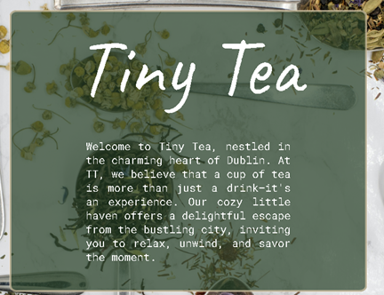

#### Reasons Why Section

- This section will draw the user in and let them know what sets Tiny Tea apart from other tea and café establishments such as late nights and cinema nights.
- As new enticing events arise, they will be posted to the “reasons why” section.

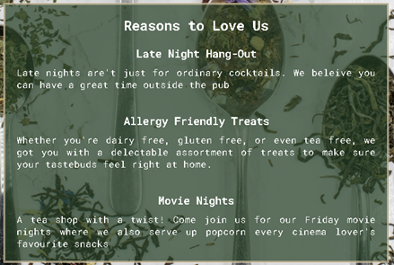

#### The Footer

- The footer includes links to the tea shop’s various social media pages.
- The footer is valuable so that a diverse group of people can stay in touch with our business and in turn help with overall growth.

#### Gallery

- The gallery will show users pictures of the inside of the shop and the different treats and tea the shop serves.
- This section is valuable to the user because they will be able to see what the establishment looks like and what kind of food/beverage it offers.

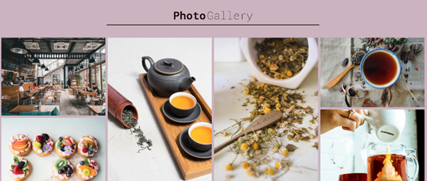

#### The Enquire Page

- This page will allow users to see what our opening hours are, where we are located, and a page to contact us with any questions, whether it be about booking the café for an event or any special requests. It is also great for business opportunities.

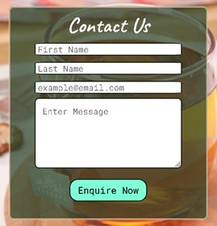
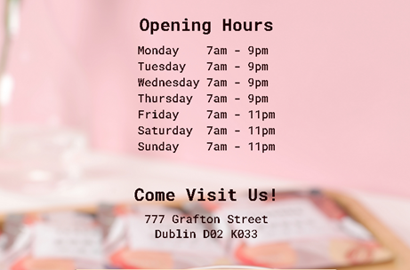

Additionally, if I had given the site more time, we would have an events section that would allow users to see past events and a schedule for future events.

### Future Features

- A video of the establishment and its activities would be valuable.
- It would also be valuable to create clickable navigation icons so that users can quickly map out our address straight from the website instead of copying and pasting the address.

## Testing

### Validator Testing

- **HTML**
 
| Page          | W3C URL       | Screebshot                         		         | Notes
|:------------- |:------------- |:---------------------------------------------- |:--------|
| Main    | https://validator.w3.org/   | 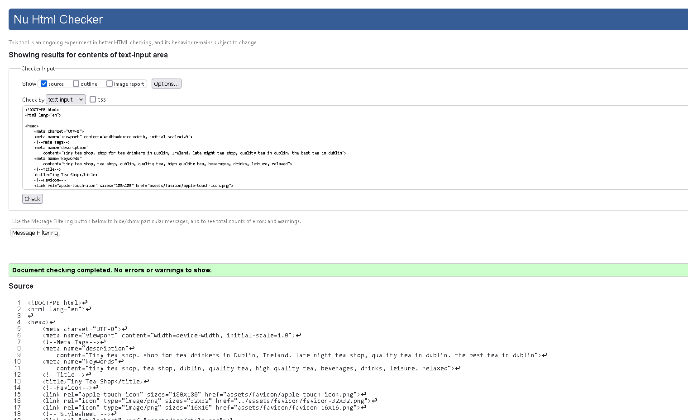  | Working|
| Gallery    | https://validator.w3.org/    | 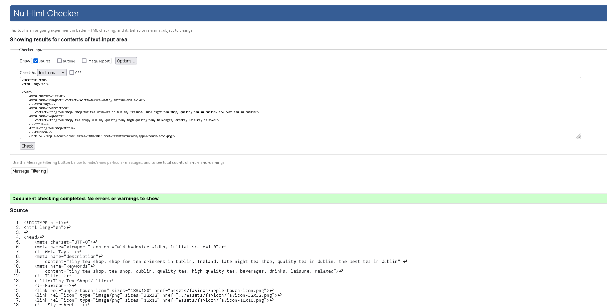| No errors found|
| Enquire     | https://validator.w3.org/    | 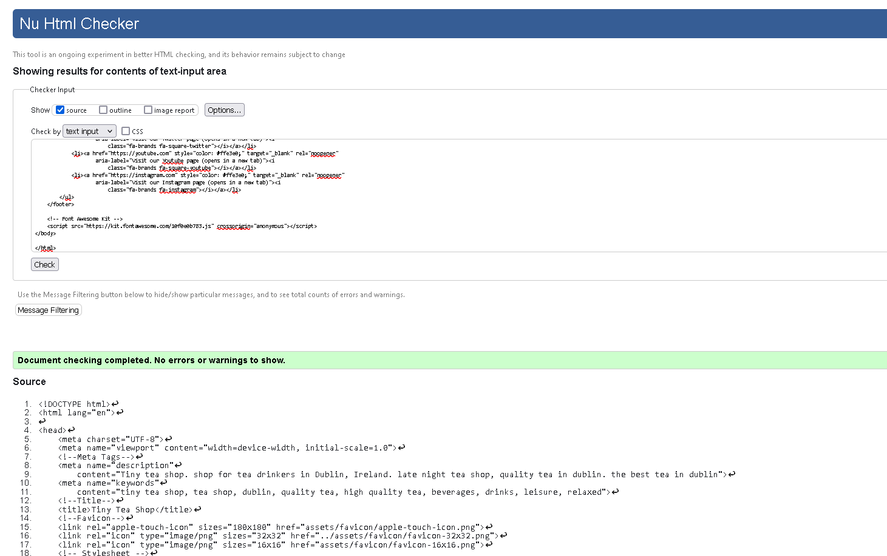 | No erros found|

- **CSS**

| File       | Jigsaw URL    | Screenshot                         		         | Notes
|:------------- |:------------- |:---------------------------------------------- |:--------|
| style.css     |   https://jigsaw.w3.org/css-validator/  | 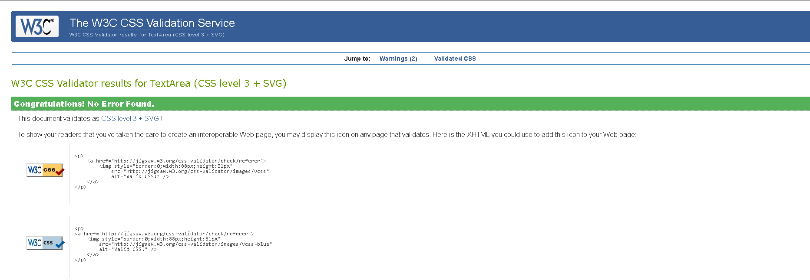 | No errors found

  - No errors were found when passing through the official (Jigsaw) validator.

- **Browswer Compatibility**

| Browser       | Main           | Gallery                      		             |Notes
|:------------- |:------------- |:---------------------------------------------- |:-------|
| Firefox     |  |  | responding as expected|
| Chrome     |   |  | responding as expected |
| Edge    |  |  | responding as expected |

-**Lighthouse Audit**

| Page          | Mobile       | Desktop                         		                           | Notes
|:------------- |:------------- |:---------------------------------------------- |:--------
| Main Page    |  |  | Warnings about load times. Reized all images but still running at 88 percent. did not know how to up performance|

### Unfixed Bugs

There were no bugs to report upon testing that I could see after debuggin the issues below. However, I could not get the mobile lighthouse test passed 88 percent mark.

-**Debbuging**
  - Initially, I found a few stray tags in the icon section of the footer, but removed these.
  - When adding another feature, I found a parse error, but also corrected this.
  - I also initially created the reasons list using an unordered list and then changed it to divs but forgot to remove the ul tags. Although it rendered perfectly on the laptop, when I deployed the site again, none of my styles had been applied. I put the code into the code validator and it immediately pointed out that the div element cannot be the child of the li element. So I adjusted accordingly.
  - I also used an h2 tag, but closed it with an h3 tag and the validator highlighted this.
  - Eventually, no errors were returned when passing through the official W3C validator.

## Deployment

- The site was deployed to GitHub pages as per CI’s tutorial page. The steps to deploy are as follows:
  - In the GitHub repository, navigate to the Settings tab.
  - From the source section drop-down menu, select the Master Branch.
  - Once the master branch has been selected, the page will be automatically refreshed with a detailed ribbon display to indicate the successful deployment.

  

The live link can be found here - [Tiny Tea Shop](https://maejors.github.io/tiny-tea-shop/)

## Credits

### Content

- Part of the contact form was created using an online YouTube tutorial with the channel CodeEntropy “Contact From in HTML/CSS website for beginners.”
- The footer was created using CI’s tutorial from Love Running.
- The icons in the footer and the leaf in the header were taken from Font Awesome.

### Media

- All photos used on the website were taken from Unsplash.

-**Landing Page Images**

- [landing page mobile image](https://unsplash.com/photos/gray-stainless-steel-spoon-xdD-x2Y2SPI)
- [landing page desktop image](https://unsplash.com/photos/gray-stainless-steel-spoon-xdD-x2Y2SPI)
- [Enquire page image](https://unsplash.com/photos/gray-stainless-steel-spoon-xdD-x2Y2SPI)

-**Gallery Page Images from top to bottom on mobile**

- [indoor of cafe](https://images.unsplash.com/photo-1555396273-367ea4eb4db5?w=400&auto=format&fit=crop&q=60&ixlib=rb-4.0.3&ixid=M3wxMjA3fDB8MHxzZWFyY2h8NTh8fGNhZmV8ZW58MHx8MHx8fDA%3D)
- [green tea](https://images.unsplash.com/photo-1470162656305-6f429ba817bf?w=400&auto=format&fit=crop&q=60&ixlib=rb-4.0.3&ixid=M3wxMjA3fDB8MHxzZWFyY2h8OHx8dGVhJTIwbGVhdmVzfGVufDB8fDB8fHww)
- [brown tea pot with class and tea](https://images.unsplash.com/photo-1571505463102-48bae91c6028?w=400&auto=format&fit=crop&q=60&ixlib=rb-4.0.3&ixid=M3wxMjA3fDB8MHxzZWFyY2h8OTl8fHRlYXxlbnwwfHwwfHx8MA%3D%3D)
- [outdoor shop area](https://images.unsplash.com/photo-1508424757105-b6d5ad9329d0?w=400&auto=format&fit=crop&q=60&ixlib=rb-4.0.3&ixid=M3wxMjA3fDB8MHxzZWFyY2h8MTR8fGNhZmV8ZW58MHx8MHx8fDA%3D)
- [made with love chamomile tea](https://images.unsplash.com/photo-1596343621063-c7a7aaf37aa6?w=400&auto=format&fit=crop&q=60&ixlib=rb-4.0.3&ixid=M3wxMjA3fDB8MHxzZWFyY2h8OTJ8fGphcnMlMjBvZiUyMHRlYXxlbnwwfHwwfHx8MA%3D%3D)
- [Jars with tea leaves](https://images.unsplash.com/photo-1563911892437-1feda0179e1b?w=400&auto=format&fit=crop&q=60&ixlib=rb-4.0.3&ixid=M3wxMjA3fDB8MHxzZWFyY2h8MjJ8fHRlYXxlbnwwfHwwfHx8MA%3D%3D)
- [lavendar tea](https://images.unsplash.com/photo-1571934811356-5cc061b6821f?w=500&auto=format&fit=crop&q=60&ixlib=rb-4.0.3&ixid=M3wxMjA3fDB8MHxzZWFyY2h8MjB8fHRlYXxlbnwwfHwwfHx8MA%3D%3D)
- [milk pouring into brown tea](https://images.unsplash.com/photo-1502303122794-aba2d55cc873?w=400&auto=format&fit=crop&q=60&ixlib=rb-4.0.3&ixid=M3wxMjA3fDB8MHxzZWFyY2h8OTF8fHRlYXxlbnwwfHwwfHx8MA%3D%3D)
- [tea bar](https://images.unsplash.com/photo-1547825407-2d060104b7f8?w=400&auto=format&fit=crop&q=60&ixlib=rb-4.0.3&ixid=M3wxMjA3fDB8MHxzZWFyY2h8MzR8fHRlYXxlbnwwfHwwfHx8MA%3D%3D)
- [tea and pastry](https://images.unsplash.com/photo-1702742400971-10b0c41a11a7?w=400&auto=format&fit=crop&q=60&ixlib=rb-4.0.3&ixid=M3wxMjA3fDB8MHxzZWFyY2h8MTJ8fHRlYSUyMGFuZCUyMHBhc3RyeXxlbnwwfHwwfHx8MA%3D%3D)

-**Missing Links**
- Could not find links to 3 images
  - hightea
  - tea tarts
  - insideshop

